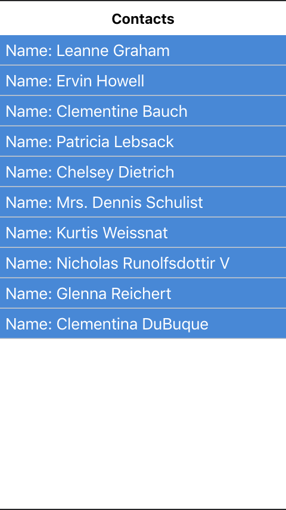

# LIQID Front End test

This test is about working with React Native to produce a web app as well as a native mobile app (IOS/Android).
Please don't write HTML and use the React Native components like `View` and `Text` to build your solution. It compiles later to html with webpack and react-native-web. Have fun :)

This app compiles to ios, android and web using React native and React native web.
for this test please choose one of ios or android that you'll want to support - no need for both.
For ios you might need Xcode and for android you might need Android Studio and JDK.
Please contact us with any questions or problems you might incounter.

## Task
- Build a contacts app with a contact list and a detailed contact view
- implement the design in the pictures (or make it better 🤨)

### Contact List page
- The contacts item list data should come from the jsonplaceholder endpoint`https://jsonplaceholder.typicode.com/users`.
- When clicked the user should be shown the detailed contact view page with all the contact's details in the design.
- The contact list should be the default home page
- Each item should show the `name` of the contact.
- On `desktop` the items and the full detailed view should be side by side
- On `ios/android/web-mobile` the list and the full view should show separately with a return/back/close button to return the user to the list

### Detailed contact page
- The page should show the contact's details as per the design

### Bonus Tasks (optional)
- add a form to add new contacts to be added to the current contacts list
- Create tests for all your components and reducers
- add images to each contact
- When clicking on the phone number the user should be redirected to the phone app (to call the number)
- When clicking on the website the user should be redirected (in a new tab) to the website of the contact
- Support both ios and android

#### If you run into problems contact us 📞 :)

## Installation
- install Xcode or android studio and follow the react native instructions [under the "Building Projects with Native Code" tab](http://facebook.github.io/react-native/docs/getting-started.html)
- Install (if you chose to support android) [adb (Android Debug Bridge)](https://developer.android.com/studio/releases/platform-tools.html)

## Running

- Native compiler - `npm run start`
- Web - `npm run web`
- IOS Simulator - `npm run ios`
- Android Simulator - `npm run android`

## Debugging

Open dev menu:
1. CMD+D (IOS) / CMD+M (Android)
2. Press "Enable Live-Reload" and press "Enable remote debugging"

[On real devices](http://facebook.github.io/react-native/releases/0.49/docs/running-on-device.html)
[React native docs](http://facebook.github.io/react-native/docs/debugging.html)
